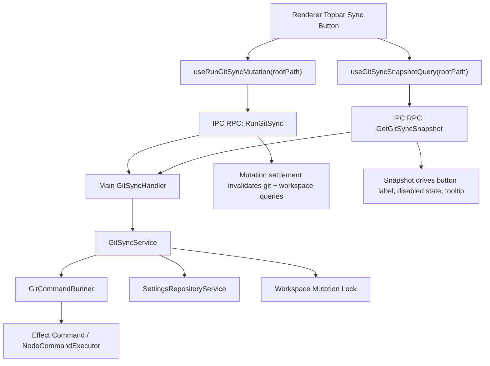

# Desktop Git Sync Design

## Objective

The desktop app should expose a top-bar `Sync` button that makes a Git-backed workspace feel like a single durable thing rather than a pile of files. The intended user action is one click. The intended system behavior is not "run a cute shell shortcut"; it is "perform a deterministic repository synchronization transaction against the currently configured workspace, using the user's real Git configuration, while preserving the codebase's Effect architecture and typed RPC boundary."

This document describes the technical design for that feature in the current repository. It is deliberately opinionated. The point is to remove ambiguity before any code is written.

## Product Contract

`Sync` means the following:

1. Discover the Git repository for the configured workspace.
2. Stage workspace changes.
3. Create a commit with message `sync` if there is anything to commit.
4. Fetch the upstream branch.
5. Rebase local commits onto the upstream branch if the remote moved.
6. Push the result.
7. Refresh renderer state so the rest of the app reflects the synchronized filesystem.

`Sync` does **not** mean any of the following:

- It does not initialize Git repositories.
- It does not create remotes.
- It does not choose a branch for the user.
- It does not force-push.
- It does not resolve conflicts automatically.
- It does not present a generic Git UI inside the app.
- It does not attempt OAuth or custom GitHub authentication flows in v1.

The button should feel simple because the app is doing disciplined repository operations behind the scenes, not because the implementation is pretending Git is simpler than it is.

## Non-Negotiable Invariants

The following invariants keep the feature honest:

### 1. Sync is repository-level, not folder-level

Git pushes branches, not directory subtrees. That matters. If the app tries to treat an arbitrary workspace subdirectory as if it were independently syncable, it will eventually lie to the user or stage the wrong files.

For v1, the clean contract is:

- `settings.workspace.rootPath` must also be the Git repository root.
- If `git rev-parse --show-toplevel` resolves to a different directory than `settings.workspace.rootPath`, sync is unavailable.

This is stricter than technically necessary, but it is correct. A looser contract is possible later, but only if the design also handles unrelated dirty files outside the managed subtree and accepts that rebase/push still operate at branch scope.

### 2. The app only uses real Git

The app should not implement Git semantics itself. It should use the user's actual `git` binary via Effect's platform command APIs.

This is the correct trade:

- The repository already exists on disk.
- The user may rely on SSH, credential helpers, hooks, LFS, global config, repo config, or branch protection rules.
- The desktop app should integrate with those systems, not replace them.

### 3. Service methods remain `R = never`

Any public service interface introduced for this feature must follow the repo's current Effect style:

- explicit service interfaces
- `Context.GenericTag`
- `Layer.effect`
- method return types with `R = never`

If a service needs `CommandExecutor`, `FileSystem`, or `Path`, the layer closes over them. That dependency does not leak into the public API.

## Architectural Decision

### Chosen approach

Use `@effect/platform/Command` and `@effect/platform-node-shared/NodeCommandExecutor` to run the system `git` binary from the Electron main process.

### Rejected approaches

#### `simple-git`

`simple-git` is reasonable as a thin wrapper around the Git CLI, but it is still a wrapper around child processes. In this codebase it is not the most idiomatic choice because:

- the repo already uses Effect pervasively
- `@effect/platform/Command` is already available through existing dependencies
- the feature benefits from typed process execution inside Effect services rather than an additional imperative abstraction

If the team later decides that a higher-level CLI wrapper materially improves readability, `simple-git` is the least bad alternative. It is not the primary design.

#### `isomorphic-git`

`isomorphic-git` is the wrong abstraction here. It is useful when the application itself must implement Git behavior, often in environments without a normal system Git installation. That is not this application. It would push transport/auth logic into app code for no product gain.

#### `nodegit`

Native bindings are unnecessary operational complexity in Electron for a feature whose main job is to orchestrate existing Git commands.

## Repo-Local Fit

The existing codebase already gives this feature a natural shape:

- renderer state is TanStack Query-based
- async desktop operations cross a typed Effect RPC boundary
- main-process services use explicit `Context.GenericTag` definitions and `Layer` composition
- shared RPC error types are modeled with `Schema.TaggedError`
- renderer hooks convert RPC defects at the call site, then map domain errors to normal `Error`

That means the sync feature should not invent a side channel. It should look like the rest of the app.

## High-Level Execution Model



## Proposed Domain Model

The shared domain model should live in a new `apps/desktop/src/shared/git/` module. This keeps Git-specific schemas, errors, and renderer mappers out of `workspace` and `settings`, which are already doing their own jobs.

### Snapshot model

The snapshot query should not encode ordinary unavailability as an error channel. A missing Git repo or missing upstream is not a crash. It is an expected product state. The renderer needs structured data it can render into a disabled button.

Use tagged data variants, not ad hoc booleans.

```ts
import { Schema } from "@effect/schema";

export class GitSyncUnavailable extends Schema.TaggedClass<GitSyncUnavailable>()(
  "GitSyncUnavailable",
  {
    reason: Schema.Literal(
      "workspace_root_not_configured",
      "git_not_installed",
      "not_a_repository",
      "workspace_root_is_not_repo_root",
      "repository_state_unreadable",
    ),
    message: Schema.String,
  },
) {}

export class GitSyncBlocked extends Schema.TaggedClass<GitSyncBlocked>()("GitSyncBlocked", {
  reason: Schema.Literal(
    "detached_head",
    "no_upstream",
    "commit_identity_missing",
    "git_operation_in_progress",
    "conflicts_present",
  ),
  message: Schema.String,
  branch: Schema.Union(Schema.String, Schema.Null),
  upstream: Schema.Union(Schema.String, Schema.Null),
}) {}

export class GitSyncReady extends Schema.Class<GitSyncReady>("GitSyncReady")({
  repoRootPath: Schema.String,
  branch: Schema.String,
  upstream: Schema.String,
  remoteName: Schema.String,
  remoteBranchName: Schema.String,
  ahead: Schema.Number,
  behind: Schema.Number,
  hasStagedChanges: Schema.Boolean,
  hasUnstagedChanges: Schema.Boolean,
  hasUntrackedChanges: Schema.Boolean,
  hasLocalChanges: Schema.Boolean,
  commitIdentityConfigured: Schema.Boolean,
}) {}

export const GitSyncSnapshotSchema = Schema.Union(GitSyncUnavailable, GitSyncBlocked, GitSyncReady);

export type GitSyncSnapshot = typeof GitSyncSnapshotSchema.Type;
```

This is more expressive than one object with nullable fields. The UI should not have to infer meaning from invalid combinations.

The `reason` sets are intentionally closed `Schema.Literal` unions. That is a deliberate RPC trade-off. Adding a new unavailable or blocked reason later is a contract change and should be treated as one.

### Sync result model

The sync mutation should return structured information about what actually happened. This avoids stringly-typed UI decisions.

```ts
export class GitSyncResult extends Schema.Class<GitSyncResult>("GitSyncResult")({
  repoRootPath: Schema.String,
  branch: Schema.String,
  upstream: Schema.String,
  createdCommit: Schema.Boolean,
  rebased: Schema.Boolean,
  pushed: Schema.Boolean,
  commitHash: Schema.Union(Schema.String, Schema.Null),
  snapshot: GitSyncReady,
}) {}
```

### Error model

Unexpected or action-failing cases should stay in the typed error channel.

```ts
export class GitCommandTransportError extends Schema.TaggedError<GitCommandTransportError>(
  "@re/desktop/git/GitCommandTransportError",
)("GitCommandTransportError", {
  command: Schema.Array(Schema.String),
  message: Schema.String,
}) {}

export class GitSyncNotReadyError extends Schema.TaggedError<GitSyncNotReadyError>(
  "@re/desktop/git/GitSyncNotReadyError",
)("GitSyncNotReadyError", {
  message: Schema.String,
}) {}

export class GitBinaryNotAvailableError extends Schema.TaggedError<GitBinaryNotAvailableError>(
  "@re/desktop/git/GitBinaryNotAvailableError",
)("GitBinaryNotAvailableError", {
  message: Schema.String,
}) {}

export class GitCommandFailedError extends Schema.TaggedError<GitCommandFailedError>(
  "@re/desktop/git/GitCommandFailedError",
)("GitCommandFailedError", {
  command: Schema.Array(Schema.String),
  exitCode: Schema.Number,
  stdout: Schema.String,
  stderr: Schema.String,
}) {}

export class GitSyncConflictError extends Schema.TaggedError<GitSyncConflictError>(
  "@re/desktop/git/GitSyncConflictError",
)("GitSyncConflictError", {
  message: Schema.String,
}) {}

export const GitSyncErrorSchema = Schema.Union(
  GitCommandTransportError,
  GitSyncNotReadyError,
  GitBinaryNotAvailableError,
  GitCommandFailedError,
  GitSyncConflictError,
);
```

The renderer then gets:

- `toGitSyncErrorMessage(error: GitSyncError): string`
- `mapGitSyncErrorToError(error: GitSyncError | Error): Error`

This follows the existing `shared/settings` and `shared/secrets` pattern.

## Main-Process Services

The design should introduce two main services.

### 1. `GitCommandRunner`

This service is the narrow effectful wrapper around the Git CLI. Its job is not to know product rules. Its job is to run `git` commands safely and return structured outputs.

```ts
export interface GitCommandRunner {
  readonly run: (input: {
    readonly cwd: string;
    readonly args: ReadonlyArray<string>;
  }) => Effect.Effect<
    {
      readonly exitCode: number;
      readonly stdout: string;
      readonly stderr: string;
    },
    GitBinaryNotAvailableError | GitCommandTransportError
  >;
}

export const GitCommandRunner = Context.GenericTag<GitCommandRunner>(
  "@re/desktop/main/GitCommandRunner",
);
```

#### Implementation notes

- Implement with `@effect/platform/Command`, not `child_process` directly.
- Do **not** run through a shell. Always use direct argument arrays.
- Use `Command.start` rather than `Command.string`, because the service must capture `stdout`, `stderr`, and `exitCode` together.
- `run` must return non-zero exit codes as data. The sync algorithm intentionally uses some Git non-zero exits as normal control flow.
- Close over `CommandExecutor.CommandExecutor` inside `Layer.effect` so the public service methods still have `R = never`.
- Close over `FileSystem` if any command-preflight logic needs it.

Pseudo-implementation:

```ts
const streamToString = (stream: Stream.Stream<Uint8Array, PlatformError>) =>
  stream.pipe(
    Stream.decodeText(),
    Stream.runFold("", (acc, chunk) => acc + chunk),
  );

const GitCommandRunnerLive = Layer.effect(
  GitCommandRunner,
  Effect.gen(function* () {
    const executor = yield* CommandExecutor.CommandExecutor;

    const run = Effect.fn("GitCommandRunner.run")(function* (input: {
      readonly cwd: string;
      readonly args: ReadonlyArray<string>;
    }) {
      const command = Command.make("git", ...input.args).pipe(
        Command.workingDirectory(input.cwd),
        Command.env({
          GIT_TERMINAL_PROMPT: "0",
          GIT_ASKPASS: "echo",
        }),
      );

      const result = yield* Effect.scoped(
        Effect.gen(function* () {
          const process = yield* executor.start(command);

          const [exitCode, stdout, stderr] = yield* Effect.all(
            [process.exitCode, streamToString(process.stdout), streamToString(process.stderr)],
            { concurrency: 3 },
          );

          return { exitCode, stdout, stderr };
        }),
      ).pipe(
        Effect.catchTag("SystemError", (error) =>
          error.reason === "NotFound"
            ? new GitBinaryNotAvailableError({
                message: "git binary is not available to the desktop app",
              })
            : new GitCommandTransportError({
                command: ["git", ...input.args],
                message: error.message,
              }),
        ),
      );

      return result;
    });

    return { run };
  }),
);
```

The exact low-level platform error mapping may vary, but the architectural point should not: the command runner is a small infrastructure service with typed errors.

### 2. `GitSyncService`

This service is the domain service. It owns sync semantics, preflight rules, Git status parsing, and command orchestration.

```ts
export interface GitSyncService {
  readonly getSnapshot: (input: { readonly rootPath: string }) => Effect.Effect<GitSyncSnapshot>;

  readonly sync: (input: {
    readonly rootPath: string;
  }) => Effect.Effect<GitSyncResult, GitSyncError>;
}

export const GitSyncService = Context.GenericTag<GitSyncService>("@re/desktop/main/GitSyncService");
```

The service depends on:

- `GitCommandRunner`
- `SettingsRepositoryService`
- `WorkspaceMutationCoordinator` or a compatibility shim that provides the same lock semantics
- `Path.Path`
- possibly `FileSystem.FileSystem`

The layer should be built with `Layer.effect`, closing over those dependencies so method signatures remain dependency-free.

`GitSyncService` should own the policy for interpreting exit codes. A small internal helper such as `expectExitCodes(result, [0])` or `expectExitCodes(result, [0, 1])` is appropriate there, because the meaning of a non-zero exit is command-specific.

## Command Executor Layer

The existing `NodeServicesLive` currently provides file system and path only. To make command execution idiomatic Effect, it should also provide the node command executor layer.

Target change:

```ts
import * as NodeCommandExecutor from "@effect/platform-node-shared/NodeCommandExecutor";
import * as NodeFileSystem from "@effect/platform-node-shared/NodeFileSystem";
import * as NodePath from "@effect/platform-node-shared/NodePath";
import { Layer } from "effect";

export const NodeServicesLive = Layer.mergeAll(
  NodeFileSystem.layer,
  NodePath.layer,
  NodeCommandExecutor.layer,
);
```

This is preferable to adding ad hoc process utilities elsewhere in main.

## Sync Availability and Button Semantics

The button should always exist in the top bar, but its enabled state depends on the snapshot variant:

- `GitSyncUnavailable`: render disabled with tooltip explaining why
- `GitSyncBlocked`: render disabled with tooltip explaining what must be fixed
- `GitSyncReady`: render enabled

Suggested label policy:

- idle: `Sync`
- mutation pending: `Syncing...`
- no toast infrastructure required in v1
- use `aria-busy` and `aria-live="polite"` for accessibility

The UI should not open confirmation dialogs for ordinary sync. If sync fails, a concise inline error surface is enough for v1. The app currently does not have a notification stack, so the design should not pretend otherwise.

If `commitIdentityConfigured === false` on an otherwise clean `GitSyncReady` snapshot, the UI should surface that as a non-blocking warning in tooltip or status copy. The button remains enabled because a pull-only or push-only sync can still succeed. The snapshot becomes blocked with `commit_identity_missing` only when a new commit would be required.

## Repository Status Discovery

The status query should use machine-oriented Git commands only. Human-readable output is not a stable integration contract.

### Required commands

Resolve repo root:

```text
git rev-parse --show-toplevel
```

Resolve Git-internal state paths in a worktree-safe way:

```text
git rev-parse --git-path rebase-merge
git rev-parse --git-path rebase-apply
git rev-parse --git-path MERGE_HEAD
git rev-parse --git-path CHERRY_PICK_HEAD
```

The implementation must then check those resolved paths with `FileSystem.exists`. `git status --porcelain=v2 --branch` cannot detect an in-progress rebase / merge / cherry-pick on its own.

Resolve current branch:

```text
git symbolic-ref --quiet --short HEAD
```

If branch resolution exits non-zero, classify the snapshot as `detached_head`.

Resolve the configured remote and merge target explicitly:

```text
git config --get branch.<branch>.remote
git config --get branch.<branch>.merge
```

Normalize `branch.<branch>.merge` from `refs/heads/<name>` into `remoteBranchName`. The snapshot can then carry both `upstream` for status display and `remoteBranchName` for explicit push targeting.

Inspect commit identity:

```text
git config --get user.name
git config --get user.email
```

Commit identity should only produce a blocked snapshot when the repository has local changes that would require a commit. A pull-only synchronization does not need `user.name` / `user.email`.

Inspect repo state:

```text
git status --porcelain=v2 --branch
```

The parser should extract:

- branch name
- upstream branch name
- ahead count
- behind count
- presence of staged changes
- presence of unstaged changes
- presence of untracked files
- presence of unmerged files

The parser should live in a pure function and be exhaustively unit-tested with representative porcelain samples. In-progress operation detection is a separate preflight step based on Git sentinel paths, not porcelain parsing.

### Why porcelain v2

Because this feature should not depend on localized, prose-formatted CLI output. Parsing `git status` text intended for humans is indefensible when porcelain output exists.

## Detailed Sync Algorithm

The mutation should be implemented as an explicit sequence of phases. The service should not collapse them into one opaque `git pull && git push` shell string.

### Phase 0: Root validation

1. Load configured settings.
2. Ensure `rootPath` matches the configured workspace root.
3. Resolve repository top-level via `git rev-parse --show-toplevel`.
4. Require `repoRootPath === rootPath` for v1.

If any of those fail, return `GitSyncNotReadyError` or a snapshot variant rather than guessing.

### Phase 1: Snapshot and preflight

1. Resolve current snapshot.
2. Fail if snapshot is `GitSyncUnavailable` or `GitSyncBlocked`.
3. Acquire the workspace mutation lock before entering any local-mutation phase.

### Phase 2: Stage workspace changes

Run this phase under the workspace mutation lock.

Run:

```text
git add -A .
```

This is correct only because the design requires repo root to equal workspace root.

Then detect whether a commit is required:

```text
git diff --cached --quiet --exit-code
```

- exit code `0`: nothing staged, skip commit
- non-zero: commit required

### Phase 3: Commit if needed

Run this phase under the workspace mutation lock.

If a commit is required:

```text
git commit -m sync
```

The app should not use `--allow-empty`.

Why commit before fetch/rebase?

- rebase requires a clean worktree
- the app should not rely on stash/autostash complexity
- a one-button flow is simpler and more deterministic if local workspace changes first become a normal commit

This means the local `sync` commit may later be rebased onto upstream. That is acceptable.

### Phase 4: Fetch upstream

Run:

```text
git fetch --prune --quiet <remoteName>
```

Do this even if the pre-click snapshot claimed the branch was up to date. The snapshot may already be stale.

This phase should run outside the workspace mutation lock. Holding a workspace-wide lock across remote I/O is unnecessary and would serialize deck saves behind network latency.

### Phase 5: Recompute status

Run the status discovery phase again after fetch. This is not optional. The decision to rebase or push must be based on current remote state, not the old snapshot.

Before any rebase step, reacquire the workspace mutation lock and rerun snapshot/preflight under that lock. If new local changes appeared while fetch was in flight, abort and ask the user to retry. Do not silently absorb late writes into the same sync transaction.

### Phase 6: Integrate remote commits

If `behind > 0`, rebase:

```text
git rebase @{upstream}
```

Why explicit `fetch` + `rebase` instead of `git pull`?

- it makes the phases observable and testable
- it avoids hiding fetch and integrate logic behind one string command
- it is easier to model in Effect as distinct typed steps

If rebase fails because of conflicts:

- fail the sync
- return `GitSyncConflictError`
- do not attempt automatic conflict resolution
- do not auto-abort rebase in the same flow

The repository should be left in the normal Git conflict state so the user can recover using Git-aware tooling.

### Phase 7: Push

Run:

```text
git push --porcelain <remoteName> HEAD:refs/heads/<remoteBranchName>
```

Do not use force push in v1. Not even `--force-with-lease`. The sync button should be conservative.

Like fetch, push should run outside the workspace mutation lock.

### Phase 8: Final snapshot

Run snapshot discovery a final time and return `GitSyncResult` with the final ready snapshot and flags indicating what actually happened.

## Crash and Restart Semantics

The design should explicitly rely on repository state as the recovery journal.

### Crash after local commit but before push

If the app crashes after Phase 3 and before Phase 7, the next sync naturally recovers:

- the branch is ahead of upstream
- the next snapshot reports that ahead state
- the next sync attempt fetches, rebases if necessary, and pushes

No separate app-level journal is required for that case.

### Crash during rebase / merge / cherry-pick

If the app crashes while Git has an operation in progress, the next snapshot must detect it via the sentinel-path checks above and return a blocked snapshot rather than pretending the repo is clean.

### Crash during fetch / push

Fetch and push are safe to retry. The next sync simply re-derives state from the repository and remote configuration.

## Mutation Locking and Interaction with Existing Deck Writes

This is the subtle part that must not be hand-waved away.

The app already mutates deck files from multiple domains:

- editor
- forge add-to-deck
- workspace create/delete/rename
- review scheduling writes

Those operations currently coordinate through `DeckWriteCoordinator`, but only at individual deck-path granularity. Git sync is a repository-wide mutation. A repository-wide operation cannot safely race normal deck writes.

### Required design change

The first implementation should move to a single workspace-root keyed mutation lock. There should not be two independent lock namespaces.

If `withDeckLock` is temporarily retained as a compatibility helper, it must forward to the exact same workspace lock instance after resolving the workspace root. A deck lock and a workspace lock must never be separate semaphores that can be acquired independently.

The honest interface is:

```ts
export interface WorkspaceMutationCoordinator {
  readonly withWorkspaceLock: <A, E, R>(
    rootPath: string,
    effect: Effect.Effect<A, E, R>,
  ) => Effect.Effect<A, E, R>;
}
```

### What I would actually do

I would replace the per-deck lock with a workspace-root keyed mutation lock and migrate existing callers. This app does not need high-throughput parallel deck writes. It does need repository correctness.

### Lock scope

The workspace mutation lock should cover only phases that mutate the workspace, index, or local Git state in ways that must not race app-originated deck writes:

- deck create / delete / rename
- editor writes
- forge add-to-deck writes
- review scheduling writes
- `git add`
- `git commit`
- `git rebase`

The lock should not be held during pure remote/network phases such as `git fetch` and `git push`.

Queued mutations may still wait on the main-process lock, but that is a normal async backlog, not a renderer-thread freeze. The design goal is correctness plus bounded waiting, not optimistic concurrent writes during repository mutation.

## RPC Contract

Git sync should get its own contract file. It is not a `workspace` operation in the same sense as scanning decks or selecting a directory.

Add:

```text
apps/desktop/src/shared/rpc/contracts/git.ts
```

With contracts roughly like:

```ts
export const GetGitSyncSnapshot = rpc(
  "GetGitSyncSnapshot",
  Schema.Struct({
    rootPath: Schema.String,
  }),
  GitSyncSnapshotSchema,
  Schema.Never,
);

export const RunGitSync = rpc(
  "RunGitSync",
  Schema.Struct({
    rootPath: Schema.String,
  }),
  GitSyncResult,
  GitSyncErrorSchema,
);
```

In this design, `GetGitSyncSnapshot` keeps `Schema.Never` and maps snapshot-time command failures such as a corrupt index or unreadable repository metadata into `GitSyncUnavailable` with reason `repository_state_unreadable`. They should not leak as RPC defects.

Then:

- export the contract from `apps/desktop/src/shared/rpc/contracts.ts`
- add a new handler module in `apps/desktop/src/main/rpc/handlers/git.ts`
- merge it into `apps/desktop/src/main/rpc/handlers.ts`

## Main RPC Handler Shape

The handler should be thin. It should not contain the algorithm. It should delegate to `GitSyncService`.

Sketch:

```ts
export const createGitHandlers = () =>
  Effect.gen(function* () {
    const gitSyncService = yield* GitSyncService;

    const handlers = {
      GetGitSyncSnapshot: ({ rootPath }) => gitSyncService.getSnapshot({ rootPath }),
      RunGitSync: ({ rootPath }) => gitSyncService.sync({ rootPath }),
    };

    return provideHandlerServices(handlers);
  });
```

That keeps the domain logic in one place and preserves the repo's current handler style.

## Renderer Architecture

### Query keys

Extend `apps/desktop/src/renderer/src/lib/query-keys.ts` with centralized keys:

```ts
gitSyncSnapshotPrefix: ["gitSyncSnapshot"] as const,
gitSyncSnapshot: (rootPath: string | null) => ["gitSyncSnapshot", rootPath] as const,
```

The key must include `rootPath`, because that changes the result.

### Query hook

Add a canonical hook:

```text
apps/desktop/src/renderer/src/hooks/queries/use-git-sync-snapshot-query.ts
```

It should:

- accept `rootPath: string | null`
- use `skipToken` when `rootPath === null`
- call `ipc.client.GetGitSyncSnapshot({ rootPath })`
- catch `RpcDefectError` at the call site
- map typed domain errors via shared mapper if needed

It should also subscribe once to `WorkspaceSnapshotChanged` and invalidate the `gitSyncSnapshot` query for the active root path, because filesystem mutations change Git status.

### Mutation hook

Add:

```text
apps/desktop/src/renderer/src/hooks/mutations/use-run-git-sync-mutation.ts
```

It should:

- accept `rootPath: string`
- use `runIpcEffect`
- on settlement, update or invalidate:
  - `queryKeys.gitSyncSnapshot(rootPath)`
  - `queryKeys.workspaceSnapshot(rootPath)`
  - `queryKeys.scanDecks(rootPath)`

Targeted invalidation is enough. No local loading booleans beyond mutation state.

Settlement matters here because a failed fetch, rebase, or push can still change refs or leave the repository in a blocked in-progress state.

### Top bar integration

The top bar currently renders the add button directly. The sync button should be inserted there, beside the existing add control, and should not introduce separate local async state machines.

The component should derive everything from:

- `useSettingsQuery()`
- `useGitSyncSnapshotQuery(rootPath)`
- `useRunGitSyncMutation()`

Button enablement rules:

- no workspace root: disabled
- unavailable snapshot: disabled
- blocked snapshot: disabled
- ready snapshot: enabled
- mutation pending: disabled with loading label

The component should not inspect raw IPC errors.

## Settings Strategy

### V1: no new persisted settings

This is the right decision.

Reasons:

1. The existing settings schema is explicitly versioned as `SettingsSchemaV1`. Adding persisted sync settings is not free; it implies schema evolution.
2. Git already stores the information that actually matters for sync:
   - repo root
   - current branch
   - upstream branch
   - remotes
   - commit identity
3. The product goal is one-click sync, not a shadow Git preferences panel.

### V1 derived configuration

Derive everything at runtime from:

- `settings.workspace.rootPath`
- repository metadata from Git commands

### Future optional settings

If later demanded by real usage, add a `sync` namespace in a new settings schema version with at most:

- `commitMessage: string` defaulting to `sync`
- `showTopbarStatusText: boolean`

Do **not** add remote/branch/rebase toggles unless the product intentionally stops being one-click sync.

## Error Handling Strategy

This design should follow the repo's existing Effect error rules.

### Domain errors are typed and serializable

Use `Schema.TaggedError` for:

- not-ready sync failures
- command failures
- conflict failures

### Expected UI states are data, not errors

Use `Schema.TaggedClass` state variants for:

- no workspace
- not a repository
- unreadable repository state
- detached head
- no upstream
- missing commit identity
- in-progress git operations

### No `unknown` classification in React

All Git-specific classification must happen in the main-process Effect pipeline before the Promise boundary. Renderer code should only call:

- `Effect.catchTag("RpcDefectError", ...)`
- `Effect.mapError(mapGitSyncErrorToError)`

### Avoid brittle stderr parsing

This is important. Do not build the whole feature around English error-message regexes. Use explicit Git queries and machine-readable status outputs to detect expected states. Reserve `stderr` primarily for user-facing diagnostic text when an operation truly fails.

## Testing Strategy

The test plan should be mostly integration-heavy, because Git behavior is the thing being relied on.

### Pure unit tests

Add unit tests for:

- porcelain v2 parser
- snapshot-to-message mapper
- result-to-label mapper if introduced

### Main-process integration tests

Create temporary repositories in tests and use the real Git binary. Cover at least:

1. workspace root is not a repo
2. workspace root is repo root, clean, up to date
3. local file change creates commit and pushes
4. remote advances, local clean, sync rebases/fast-forwards correctly
5. remote advances, local commit exists, sync rebases and pushes
6. rebase conflict returns `GitSyncConflictError`
7. missing upstream blocks sync
8. detached HEAD blocks sync
9. missing `user.name` / `user.email` is surfaced as a warning when clean and blocks commit-required sync when dirty
10. in-progress rebase / merge / cherry-pick is detected from Git sentinel paths
11. crash after local commit but before push recovers on the next sync attempt

Use a local bare repo as the remote instead of mocking push/fetch.

### RPC handler tests

Follow existing handler test patterns:

- test typed result schemas
- test typed error mapping
- test that handlers use the service rather than duplicating logic

### Renderer tests

At minimum:

- top bar renders disabled `Sync` with unavailable snapshot
- top bar renders enabled `Sync` with ready snapshot
- click triggers mutation
- pending state renders `Syncing...`

## Proposed File Additions and Changes

### New shared files

```text
apps/desktop/src/shared/git/schema.ts
apps/desktop/src/shared/git/errors.ts
apps/desktop/src/shared/git/index.ts
apps/desktop/src/shared/rpc/contracts/git.ts
```

### New main files

```text
apps/desktop/src/main/git/command-runner.ts
apps/desktop/src/main/git/sync-service.ts
apps/desktop/src/main/di/services/GitSyncService.ts
apps/desktop/src/main/di/services/WorkspaceMutationCoordinatorService.ts
apps/desktop/src/main/rpc/handlers/git.ts
apps/desktop/src/main/workspace/workspace-mutation-coordinator.ts
```

### Existing main files to update

```text
apps/desktop/src/main/effect/node-services.ts
apps/desktop/src/main/di/index.ts
apps/desktop/src/main/di/layers/main-live.ts
apps/desktop/src/main/rpc/handlers.ts
apps/desktop/src/main/rpc/deck-write-coordinator.ts
apps/desktop/src/main/index.ts
```

### New renderer files

```text
apps/desktop/src/renderer/src/hooks/queries/use-git-sync-snapshot-query.ts
apps/desktop/src/renderer/src/hooks/mutations/use-run-git-sync-mutation.ts
```

### Existing renderer files to update

```text
apps/desktop/src/renderer/src/lib/query-keys.ts
apps/desktop/src/renderer/src/components/topbar.tsx
```

## Suggested Implementation Sequence

1. Add shared git schemas, snapshot variants, error types, and mappers.
2. Extend `NodeServicesLive` with `NodeCommandExecutor.layer`.
3. Introduce `GitCommandRunner` with focused tests.
4. Introduce `GitSyncService` with snapshot and sync methods.
5. Add or evolve the mutation coordinator so sync cannot race deck writes.
6. Add Git RPC contracts and handlers.
7. Add renderer query key, query hook, mutation hook.
8. Integrate the top bar button.
9. Add integration tests against temporary Git repos.

That order keeps complexity layered correctly. Writing the top-bar button before the main service would be backwards.

## Future Extensions

These are intentionally deferred:

- background auto-sync
- sync history UI
- in-app conflict resolution UI
- Git repository initialization wizard
- remote selection UI
- branch selection UI
- OAuth/GitHub-specific auth flows
- syncing a workspace subdirectory inside a larger repo

None of those are needed to make the core feature valuable.

## Final Recommendation

The feature should be implemented as a normal Effect subsystem, not as a special-case shell hack:

- typed shared Git schemas
- explicit `GitCommandRunner` and `GitSyncService`
- `Layer.effect` implementations
- machine-readable Git status parsing
- non-interactive Git CLI execution through Effect `Command`
- a strict repo-root contract for v1
- renderer state owned by TanStack Query

That design is aligned with the repo's existing architecture, keeps the user interaction to one click, and avoids the trap of building a fake Git abstraction that becomes impossible to maintain.
